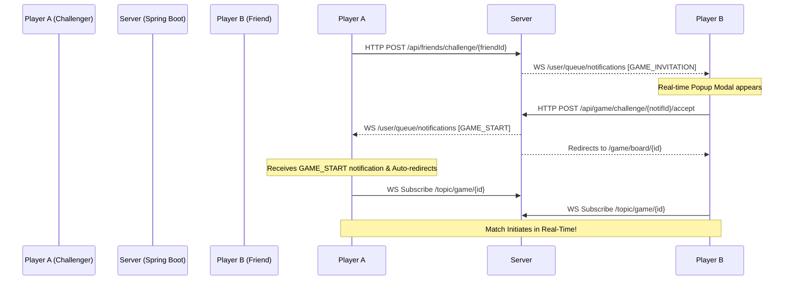

# 🎮 XO Arcade - Real-Time Multiplayer Tic Tac Toe

XO Arcade is a modern, real-time multiplayer gaming application. It allows players to sign up, manage friend circles, challenge friends to matches in real-time, create public/private game lobbies, and view live play stats on a sleek, responsive dark slate dashboard.

---

## 🛠️ Technology Stack
* **Backend:** Spring Boot (Java 17+), Spring Security, Spring Data JPA, Spring WebSockets (STOMP over SockJS).
* **Frontend:** JSP (JavaServer Pages), JSTL, Bootstrap 5, Vanilla CSS, Vanilla Javascript.
* **Auth & DB Host:** Supabase (JWT Authentication & PostgreSQL).
* **JSON Processing:** Jackson.

---

## 🏗️ Architecture & Core Entities

The system uses a relational PostgreSQL schema mapped via Hibernate/JPA:

1. **User (`User.java`):** 
   Holds user state including Supabase UUID, username, email, online status, avatar image, and rank score.
2. **GameSession (`GameSession.java`):**
   Manages match state, including the 3x3 board representation (comma-separated string), player X & O associations, current turn, status (`WAITING`, `PLAYING`, `WON`, `DRAW`), and the winner.
3. **Friend (`Friend.java`) & FriendRequest (`FriendRequest.java`):**
   Handles friend connections, user blocks, pending request logic, and real-time requests.
4. **Notification (`Notification.java`):**
   Powers real-time user notification cards (`GAME_INVITATION`, `GAME_START`, `FRIEND_REQUEST`, `FRIEND_ACCEPT`).
5. **MatchHistory (`MatchHistory.java`):**
   Logs match outcomes (win, loss, draw), move counts, match durations, and opponent references.

---

## 🔌 Real-Time WebSocket Messaging Flow

WebSockets use STOMP over SockJS to synchronize game state and push notifications instantly:



### WS Endpoints
* **`/user/queue/notifications`:** Individual message queue used to push real-time notifications (friend requests, game invites, game-start redirection signals) directly to the user's browser session.
* **`/topic/game/{gameSessionId}`:** Public broadcast channel for active game rooms. Coordinates board move selections, opponent forfeit status, and rematch confirmations.

---

## 🔒 Security & JWT Verification

1. **JWT Verification Engine (`SupabaseJwtVerifier.java`):**
   Decodes and validates Supabase-issued security tokens. Supports both symmetric HMAC `HS256` keys and asymmetric ECDSA `ES256` signature verification (by parsing Elliptic Curve JWK coordinates $x$ and $y$).
2. **Authentication Filter (`JwtFilter.java`):**
   Intercepts requests, extracts the token from the `access_token` cookie, runs verification, syncs/registers the User record inside the local PostgreSQL DB, and establishes the Spring Security `SecurityContext`.
3. **WebSocket Principal Matching (`AuthenticatedUser.java`):**
   Implements `java.security.Principal` to bind the WebSocket session to the user's database UUID. This ensures real-time target notifications (`convertAndSendToUser`) route correctly.

---

## 🎮 Game Workflows & User Actions

### 1. Authenticating
* Login & Signup forms interact with **Supabase Authentication** client-side.
* Upon validation, a JWT token is saved as a secure cookie (`access_token`), which is sent with subsequent requests to Spring Boot.

### 2. Matchmaking (Lobby Room)
* **Hosting:** A player creates a game room and receives a unique 6-character room key. The waiting room subscribes to `/topic/game/{id}`.
* **Joining:** An opponent enters the room key on their dashboard. The status transitions to `PLAYING` and both players redirect to the game board.

### 3. Direct Match Challenges
* Players can search other accounts under the **Friends** page.
* Sending a friend request triggers a real-time WebSocket toast for the receiver.
* Once accepted, clicking the **Challenge** button sends a real-time prompt. If the friend accepts, both players transition to the board simultaneously.

### 4. Interactive Gameplay
* Each click in the grid validates turns and broadcasts moves over `/app/game/move`.
* The board UI updates instantly using high-performance CSS grid layouts, showing smooth, refined X and O symbols.
* Match results are immediately written to the match history, profiles update, and the victory/defeat end modal appears.

---

## ⚙️ How to Run & Build
1. **Clean Cached Compilation Files:**
   ```powershell
   Remove-Item -Recurse -Force target
   ```
2. **Build and Run:**
   Execute clean compilation and launch the Spring Boot application using Maven:
   ```bash
   mvn clean spring-boot:run
   ```
3. **Browser Refresh:**
   Launch `http://localhost:8080` and use `Ctrl` + `F5` to refresh client-side styles.

<p align="center">
  <a href="https://xo-arcade.onrender.com/" target="_blank">
    
  </a>
</p>
